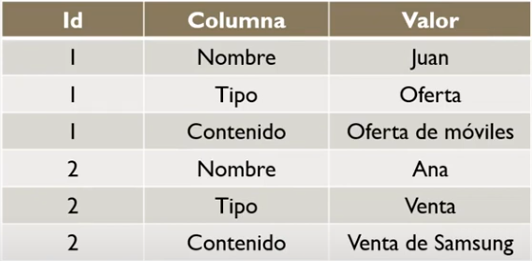
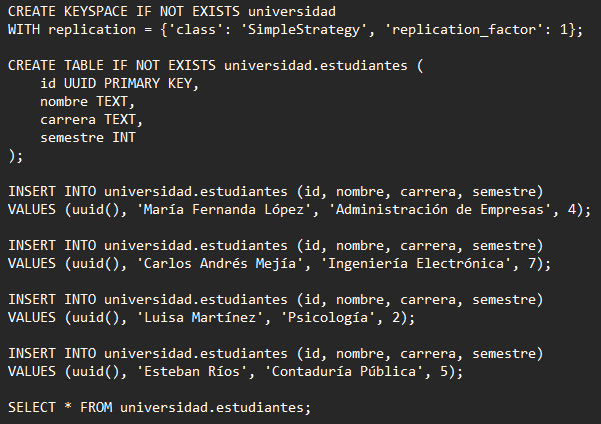
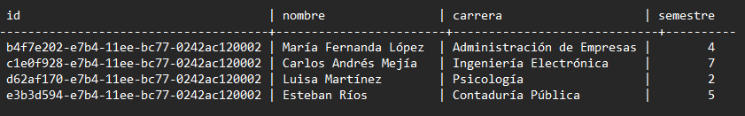
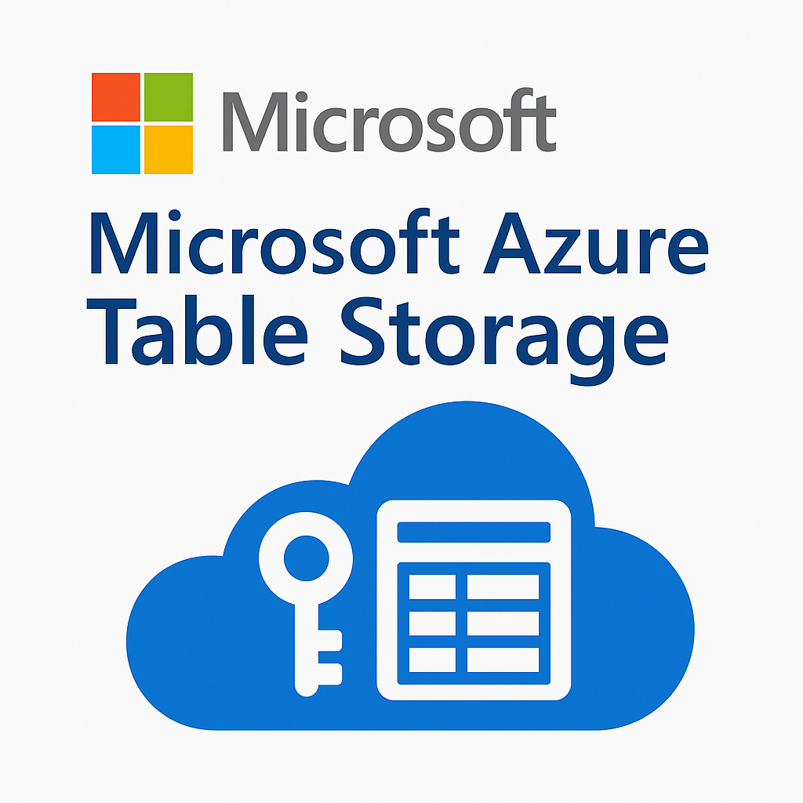
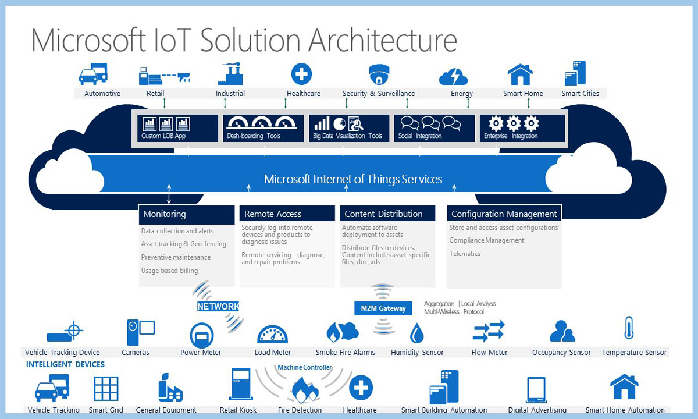
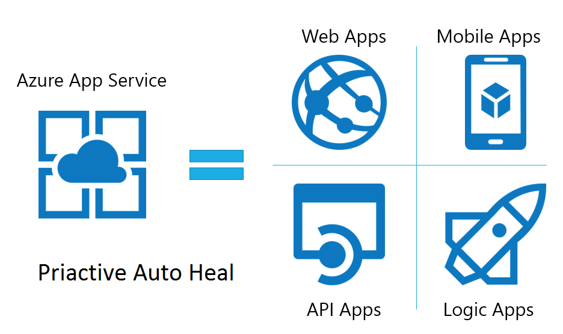
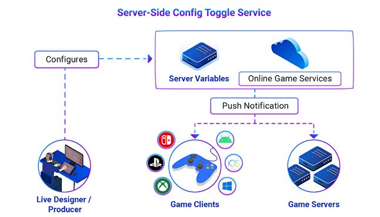

id: identificador-unico-del-codelab
title: Bases de Datos No-SQL Orientadas a Columnas
summary: El Codelab guiará a los usuarios a través de la comprensión fundamental de las bases de datos No-SQL orientadas a columnas, sus características distintivas, aplicaciones prácticas, pros y contras, y ejemplos concretos.
author: Tu Nombre
categories: codelab,markdown
environments: Web
status: Published
feedback link: https://github.com/tu_usuario/tu_repo/issues
analytics account: UA-XXXXXX-X

# NO-SQL Orientado a Columnas

## ¿Qué es "Orientado a Columnas"?
Duration: 0:03:00

Las bases de datos orientadas a columnas son un tipo de almacenamiento NoSQL que organiza los datos por columnas en lugar de por filas, lo que ofrece ventajas significativas para ciertos casos de uso.

### Concepto fundamental

Almacena datos agrupados por columnas, en lugar de por filas como las bases de datos tradicionales. Esto permite:

* Lecturas y agregaciones de columnas muy rápidas, ideal para analítica
* Compresión eficiente de datos similares agrupados
* Acceso optimizado a subconjuntos específicos de datos

A veces se conoce como "wide-column store" o almacén de columnas anchas.

### Modelo de Datos

* **Column Family**: similar a tabla; agrupa columnas relacionadas
* **Row Key**: clave única de cada fila
* **Columns**: pares (nombre, valor, timestamp)
* **Super-columnas** (opcional): agrupaciones de columnas anidadas



### Casos de Uso

Las bases de datos orientadas a columnas son ideales para:

* **Análisis de clickstream y comportamiento web**: Registro de eventos de usuarios (clics, páginas vistas, tiempo en página) con timestamps.
* **Telemetría de IoT a gran escala**: Recogida continua de millones de métricas (temperatura, presión, humedad, posición GPS) desde dispositivos y sensores distribuidos.
* **Paneles de métricas y dashboards en tiempo real**: Monitorización de KPIs (ventas por canal, visitas, tasa de conversión) con actualizaciones cada pocos segundos.

### Ventajas y Desventajas

#### Ventajas
* Altas tasas de escritura y lectura de columnas específicas
* Excelente compresión y ahorro de espacio
* Escalado horizontal sencillo y alta disponibilidad
* Consistencia ajustable (tunable consistency)

#### Desventajas
* Consultas complejas no óptimas (no SQL JOIN)
* Carga incremental de datos puede ser subóptima
* Menor madurez de herramientas BI frente a RDBMS
* Curva de aprendizaje en diseño de esquema y tuning

## Apache Casandra
Duration: 0:05:00

Apache Cassandra es un sistema de gestión de bases de datos **NoSQL** distribuido y altamente escalable, diseñado para manejar grandes volúmenes de datos en múltiples servidores sin un único punto de fallo.​ Es ideal para aplicaciones que requieren características como: **Alta disponibilidad**, **Alta velocidad de escritura** y **lectura, Escalabilidad horizontal** (puedes añadir más columnas fácilmente).

### Historia de Apache Cassandra

* En 2007 **Facebook** crea Cassandra para gestionar el motor de búsqueda de mensajes (**Inbox Search**), combinando lo mejor de **Amazon Dynamo** (**alta disponibilidad**) y Google Bigtable (**modelo de datos flexible**).
* En 2008 **Facebook** libera **Cassandra** como código abierto.
* En 2009 **Cassandra** se convierte en un proyecto de **Apache Incubator**. Poco después, se vuelve un proyecto de nivel superior dentro de la **Apache Software Foundation**.
* En 2010 Empresas como **Twitter**, **Netflix**, **eBay** y **Apple** comienzan a usar **Cassandra** para aplicaciones críticas.
* En 2020 – 2024 Se lanzan versiones más estables como 3.x, 4.x, con mejoras en rendimiento, seguridad y facilidad de operación.
* En la actualidad **Cassandra** es una de las bases de datos **NoSQL** más utilizadas en sistemas distribuidos, con una comunidad activa y soporte empresarial.

### DDL de Apache Cassandra
| Comando DDL | Descripción                                      | Ejemplo                                                                                                                               |
|-------------|----------------------------------------------------------|---------------------------------------------------------------------------------------------------------------------------------------|
| CREATE KEYSPACE | Crea un nuevo keyspace (una base lógica para las tablas)​       | `CREATE KEYSPACE tienda WITH replication = {'class': 'SimpleStrategy', 'replication_factor': 3};​`                                  |
| DROP KEYSPACE   | Elimina un KEYSPACE.                 | `DROP KEYSPACE tienda;`                                                                                                             |
| CREATE TABLE  | Crea una nueva tabla con claves primarias definidas​      | `CREATE TABLE productos (id UUID PRIMARY KEY, nombre TEXT, precio DECIMAL);​`                                                                            |
| ALTER TABLE   | Modifica una tabla existente (añadir columnas, por ejemplo)​. | `ALTER TABLE productos ADD stock INT;`                                                                                   |
| DROP TABLE    | Elimina una tabla​                             | `DROP TABLE productos;​`                                                                                                                  |
| USE           | Selecciona el keyspace activo.                          | `USE tienda;`                                                                                                                          |

### DML de Apache Cassandra
| Comando CQL | Descripción en Español                | Ejemplo                                                                 |
|-------------|---------------------------------------|-------------------------------------------------------------------------|
| INSERT      | Agrega nuevas filas o registros a las tablas | `INSERT INTO productos (id, nombre, precio, stock) VALUES (uuid(), 'Laptop', 3500.00, 20);` |
| SELECT      | Consulta datos​ | `SELECT * FROM productos;​`                     |
| UPDATE      | Modifica valores de una fila existente​. | `UPDATE productos SET stock = 15 WHERE id = ...;`   |
| DELETE      | Elimina una fila o columna espécifica​      | `DELETE FROM productos WHERE id = ...;​`                                  |

### Instalacion de Apache Cassandra
### JAVA11
* Es necesario que se instale java 11 para poder usar cassandra​
### Variables de entorno​
* Es necesario configurar java como variable de entorno para poder iniciarlizar cassandra​
### Otros lenguajes​
* En necesario el lenguaje de programacion con le que se interactuará con la base de datos​

### Ejemplo en Apache Cassandra
### Codificacion.

### Salida en Cassandra DB


## Microsoft Azure Cosmos DB
Duration: 0:03:00

### Cajas de información
Texto plano.

### Lista con viñetas
Texto plano en una lista con viñetas:

* Hola
* CodeLab
* Mundo

¡Ya tienes tu lista con viñetas creada!

### Lista numerada
1. Lista
2. Utilizando
3. Números

¡Ya tienes tu lista numerada creada!

## APACHE HBASE
Duration: 0:03:00

### Cajas de información
Texto plano.

### Lista con viñetas
Texto plano en una lista con viñetas:

* Hola
* CodeLab
* Mundo

¡Ya tienes tu lista con viñetas creada!

### Lista numerada
1. Lista
2. Utilizando
3. Números

¡Ya tienes tu lista numerada creada!

## DataStax Enterprise 
Duration: 0:03:00

### Cajas de información
Texto plano.

### Lista con viñetas
Texto plano en una lista con viñetas:

* Hola
* CodeLab
* Mundo

¡Ya tienes tu lista con viñetas creada!

### Lista numerada
1. Lista
2. Utilizando
3. Números

¡Ya tienes tu lista numerada creada!

## ScyllaDB 
Duration: 0:03:00

### ¿La base de datos más rápida?

**ScyllaDB** es una base de datos NoSQL distribuida, de código abierto, diseñada desde cero en **C++** para aprovechar al máximo el hardware moderno. Es una alternativa compatible con Apache Cassandra pero con un rendimiento superior.

---

### Características Clave

* **Lenguaje de Programación:** Escrita en **C++**, a diferencia de otras como MongoDB que usan Java.
* **Compatibilidad:** Soporta **CQL** (Cassandra Query Language) y utiliza formatos **SSTable**.
* **Modelo de Datos:** Almacenamiento en **columnas**, similar a MySQL. No basado en documentos como MongoDB.
* **Motor Alternativo a Cassandra:** Reescrito completamente para mejorar eficiencia.

---

### ¿Por qué ScyllaDB es más rápida?

* **Lenguaje de Bajo Nivel (C++):** Menor sobrecarga comparado con Java.
* **Seastar:** Biblioteca asincrónica que permite operaciones no bloqueantes.
  1. Menor latencia.
  2. Mayor rendimiento.
* **Optimización del Hardware:** 
  1. Exprime al máximo las capacidades del servidor moderno.

---

### Adopción y Casos de uso
* **Discord:** Plataforma de comunicación masiva.

* **Samsung:** Diversas aplicaciones empresariales.

* **AppsFlyer:** Análisis de marketing.

* **Zillow:** Mercado inmobiliario digital.

* **Outbrain:** Descubrimiento de contenido.

* Y muchas más empresas con alta demanda de rendimiento.

---

### Comandos DDL en ScyllaDB
Comandos más comúnes para definir y administrar la estructura de la base de datos.
| Comando CQL | Descripción                                      | Ejemplo                                                                                                                               |
|-------------|----------------------------------------------------------|---------------------------------------------------------------------------------------------------------------------------------------|
| CREATE KEYSPACE | Crea un nuevo espacio de nombres (base de datos).       | `CREATE KEYSPACE mitienda WITH replication = {'class': 'SimpleStrategy', 'replication_factor': 1};`                                  |
| DROP KEYSPACE   | Elimina un espacio de nombres existente.                 | `DROP KEYSPACE mitienda;`                                                                                                             |
| CREATE TABLE  | Crea una nueva tabla dentro del keyspace activo.      | `CREATE TABLE usuarios (id UUID PRIMARY KEY, nombre TEXT);`                                                                            |
| ALTER TABLE   | Modifica la estructura de una tabla (añadir/eliminar columnas). | `ALTER TABLE usuarios ADD COLUMN email TEXT;`                                                                                   |
| DROP TABLE    | Elimina una tabla existente.                             | `DROP TABLE usuarios;`                                                                                                                  |
| USE           | Selecciona el keyspace activo.                          | `USE mi_app;`                                                                                                                          |

---

### Comandos DML en ScyllaDB
Comandos para trabajar con los datos dentro de las tablas.

| Comando CQL | Descripción en Español                | Ejemplo                                                                 |
|-------------|---------------------------------------|-------------------------------------------------------------------------|
| INSERT      | Agrega nuevos registros a las tablas. | `INSERT INTO usuarios (id, nombre, email) VALUES (uuid(), 'Ana', 'ana@email.com');` |
| SELECT      | Recupera datos de una o más tablas. | `SELECT nombre, email FROM usuarios WHERE id = ...;`                     |
| UPDATE      | Modifica registros existentes en una tabla. | `UPDATE usuarios SET email = 'ana.nueva@email.com' WHERE id = ...;`   |
| DELETE      | Elimina registros de una tabla.      | `DELETE FROM usuarios WHERE id = ...;`                                  |


---

### Problemas Comunes en la Instalación

* **Sistema:** Necesidad de Linux moderno con suficiente RAM y espacio en disco.
* **Red:** Puertos bloqueados o IPs mal configuradas.
* **Dependencias:** Paquetes faltantes o mal instalados.
* **`scylla.yaml`:** Archivo de configuración principal mal escrito.
* **Permisos:** Problemas de acceso a carpetas o archivos.
* **Conflictos de Puertos:** Otros servicios usando los mismos puertos.

---
### Compatibilidad

* **Optimizado para Linux:** Especialmente Ubuntu.
* **Windows:** Recomendado usar **Docker** para ejecutarlo.

---

### Demostración Práctica

#### 1. Crear configuración de Docker Compose

```yaml
version: '3'
services:
  scylla-node1:
    image: scylladb/scylla
    ports:
      - "9042:9042"
    volumes:
      - scylla-data1:/var/lib/scylla
    command: --seeds=scylla-node1

volumes:
  scylla-data1:
```
#### 2. Crear estructura de datos

```sql
CREATE KEYSPACE tienda WITH replication = {
  'class': 'SimpleStrategy',
  'replication_factor': 1
};
USE tienda;

CREATE TABLE productos (
  id UUID PRIMARY KEY,
  nombre TEXT,
  precio DECIMAL,
  stock INT,
  categoria TEXT
);

CREATE INDEX idx_categoria ON productos (categoria);
```

#### 3. Operaciones básicas con datos

```sql
-- Insertar producto
INSERT INTO productos (id, nombre, precio, stock, categoria)
VALUES (uuid(), 'Laptop Pro', 1299.99, 50, 'Electrónicos');

-- Consultar productos
SELECT * FROM productos;

-- Filtrar por categoría
SELECT * FROM productos WHERE categoria = 'Electrónicos';

-- Actualizar stock
UPDATE productos SET stock = stock - 1 WHERE id = [ID_PRODUCTO];

-- Eliminar producto
DELETE FROM productos WHERE id = [ID_PRODUCTO];
```

#### 4. Rendimiento y monitoreo

```sql
-- Activar rastreo para analizar rendimiento
TRACING ON;
SELECT * FROM productos WHERE categoria = 'Electrónicos';
TRACING OFF;

-- Ver estado del sistema
DESCRIBE KEYSPACES;
DESCRIBE TABLES;

-- Estadísticas del sistema
nodetool status
nodetool tablestats tienda.productos
```

## Google Cloud
Duration: 0:03:00

### Cajas de información
Texto plano.

### Lista con viñetas
Texto plano en una lista con viñetas:

* Hola
* CodeLab
* Mundo

¡Ya tienes tu lista con viñetas creada!

### Lista numerada
1. Lista
2. Utilizando
3. Números

¡Ya tienes tu lista numerada creada!

## Microsoft Azure  

**Duración:** 0:03:00

---

### 🧊 Cajas de información  

### Microsoft Azure Table Storage

---

### ⚙️ Características Técnicas

* **Modelo NoSQL basado en tablas:** Estructura de almacenamiento tipo key-value con propiedades personalizables.  
* **Escalabilidad automática:** Capacidad para manejar grandes volúmenes de datos sin configuración adicional.  
* **Alta disponibilidad y durabilidad:** Garantizado por la infraestructura de Azure.  
* **Acceso a través de REST API y SDKs:** Compatible con .NET, Java, Python, Node.js, etc.  
* **Costo-efectivo:** Pago por uso y almacenamiento, ideal para datos semiestructurados.

---

### 🚀 Adopción y Casos de Uso

* **Microsoft Services:** Almacén de telemetría y eventos.  
  
* **IoT Solutions:** Almacenamiento de datos de sensores.  
  
* **Aplicaciones Web:** Guardado de perfiles de usuarios y sesiones.  
  
* **Gaming Backends:** Datos de jugadores, puntuaciones y configuraciones.  
  
* **Logs y Auditorías:** Eventos de sistemas distribuidos.  
  

---

### 🧪 Operaciones Básicas en Table Storage (REST o SDK)

| Operación | Descripción                   | Ejemplo SDK (.NET)                                         |
|-----------|-------------------------------|------------------------------------------------------------|
| Insert    | Agrega una nueva entidad      | `await tableClient.AddEntityAsync(entidad);`              |
| Retrieve  | Obtiene una entidad por clave | `await tableClient.GetEntityAsync<T>("PartitionKey", "RowKey");` |
| Update    | Modifica una entidad existente| `await tableClient.UpdateEntityAsync(entidad, ETag.All);` |
| Delete    | Elimina una entidad           | `await tableClient.DeleteEntityAsync("PartitionKey", "RowKey");` |
| Query     | Busca múltiples entidades     | `tableClient.QueryAsync<T>(f => f.Prop == "valor");`      |

---

### ❗ Problemas Comunes en la Configuración

* Falta de conexión al Storage Account.  
* Errores de autenticación con claves mal configuradas.  
* Acceso desde SDKs sin roles o permisos asignados.  
* Restricciones de red en cuentas de almacenamiento.  
* Formatos incorrectos en `PartitionKey` o `RowKey`.

---

### 💻 Compatibilidad

* **Lenguajes Soportados:**  
  * .NET (C#), Python, Java, Node.js, Go  
* **Acceso multiplataforma:**  
  * Usable desde Windows, Linux o macOS  
* **Integración nativa con servicios de Azure:**  
  * Azure Functions, Logic Apps, Event Grid

---

### 🔧 Demostración Práctica

#### Paso a paso en .NET

```csharp
var serviceClient = new TableServiceClient("<Connection_String>");
var tableClient = serviceClient.GetTableClient("clientes");
await tableClient.CreateIfNotExistsAsync();

var cliente = new TableEntity("LATAM", "cliente001")
{
    { "Nombre", "Carlos" },
    { "Correo", "carlos@email.com" },
    { "Edad", 32 }
};
await tableClient.AddEntityAsync(cliente);

var entidad = await tableClient.GetEntityAsync<TableEntity>("LATAM", "cliente001");
Console.WriteLine(entidad.Value["Nombre"]);

entidad.Value["Edad"] = 33;
await tableClient.UpdateEntityAsync(entidad, ETag.All);

await tableClient.DeleteEntityAsync("LATAM", "cliente001");

## IBM Db2

Duration: 0:03:00

### Cajas de información
Texto plano.

### Lista con viñetas
Texto plano en una lista con viñetas:

* Hola
* CodeLab
* Mundo

¡Ya tienes tu lista con viñetas creada!

### Lista numerada
1. Lista
2. Utilizando
3. Números

¡Ya tienes tu lista numerada creada!