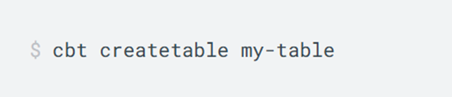
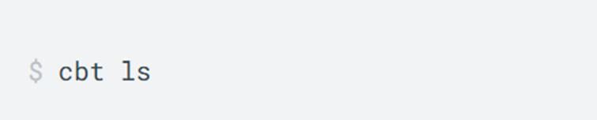
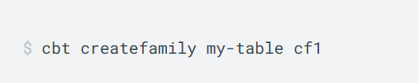
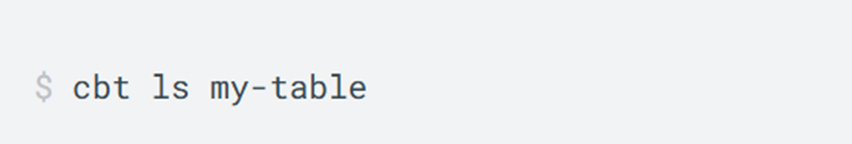
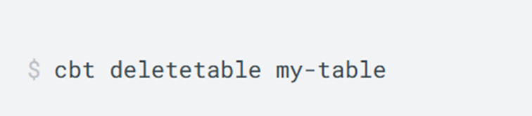
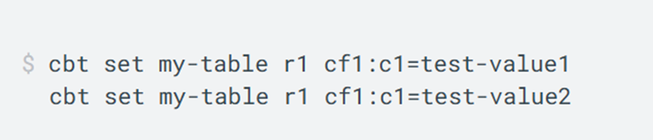
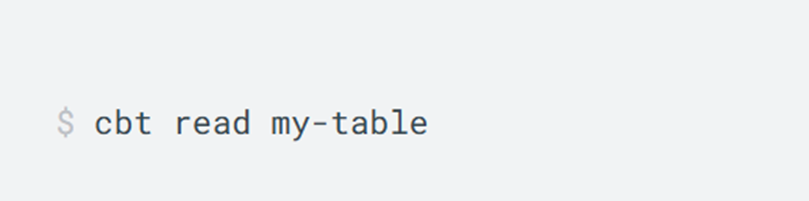

id: identificador-unico-del-codelab
title: Bases de Datos No-SQL Orientadas a Columnas
summary: El Codelab guiará a los usuarios a través de la comprensión fundamental de las bases de datos No-SQL orientadas a columnas, sus características distintivas, aplicaciones prácticas, pros y contras, y ejemplos concretos.
author: Tu Nombre
categories: codelab,markdown
environments: Web
status: Published
feedback link: https://github.com/tu_usuario/tu_repo/issues
analytics account: UA-XXXXXX-X

# NO-SQL Orientado a Columnas

## ¿Qué es "Orientado a Columnas"?
Duration: 0:03:00

Las bases de datos orientadas a columnas son un tipo de almacenamiento NoSQL que organiza los datos por columnas en lugar de por filas, lo que ofrece ventajas significativas para ciertos casos de uso.

### Concepto fundamental

Almacena datos agrupados por columnas, en lugar de por filas como las bases de datos tradicionales. Esto permite:

* Lecturas y agregaciones de columnas muy rápidas, ideal para analítica
* Compresión eficiente de datos similares agrupados
* Acceso optimizado a subconjuntos específicos de datos

A veces se conoce como "wide-column store" o almacén de columnas anchas.

### Modelo de Datos

* **Column Family**: similar a tabla; agrupa columnas relacionadas
* **Row Key**: clave única de cada fila
* **Columns**: pares (nombre, valor, timestamp)
* **Super-columnas** (opcional): agrupaciones de columnas anidadas


### Casos de Uso

Las bases de datos orientadas a columnas son ideales para:

* **Análisis de clickstream y comportamiento web**: Registro de eventos de usuarios (clics, páginas vistas, tiempo en página) con timestamps.
* **Telemetría de IoT a gran escala**: Recogida continua de millones de métricas (temperatura, presión, humedad, posición GPS) desde dispositivos y sensores distribuidos.
* **Paneles de métricas y dashboards en tiempo real**: Monitorización de KPIs (ventas por canal, visitas, tasa de conversión) con actualizaciones cada pocos segundos.

### Ventajas y Desventajas

#### Ventajas
* Altas tasas de escritura y lectura de columnas específicas
* Excelente compresión y ahorro de espacio
* Escalado horizontal sencillo y alta disponibilidad
* Consistencia ajustable (tunable consistency)

#### Desventajas
* Consultas complejas no óptimas (no SQL JOIN)
* Carga incremental de datos puede ser subóptima
* Menor madurez de herramientas BI frente a RDBMS
* Curva de aprendizaje en diseño de esquema y tuning

## Apache Casandra
Duration: 0:05:00

Apache Cassandra es un sistema de gestión de bases de datos **NoSQL** distribuido y altamente escalable, diseñado para manejar grandes volúmenes de datos en múltiples servidores sin un único punto de fallo.​ Es ideal para aplicaciones que requieren características como: **Alta disponibilidad**, **Alta velocidad de escritura** y **lectura, Escalabilidad horizontal** (puedes añadir más columnas fácilmente).

### Historia de Apache Cassandra

* En 2007 **Facebook** crea Cassandra para gestionar el motor de búsqueda de mensajes (**Inbox Search**), combinando lo mejor de **Amazon Dynamo** (**alta disponibilidad**) y Google Bigtable (**modelo de datos flexible**).
* En 2008 **Facebook** libera **Cassandra** como código abierto.
* En 2009 **Cassandra** se convierte en un proyecto de **Apache Incubator**. Poco después, se vuelve un proyecto de nivel superior dentro de la **Apache Software Foundation**.
* En 2010 Empresas como **Twitter**, **Netflix**, **eBay** y **Apple** comienzan a usar **Cassandra** para aplicaciones críticas.
* En 2020 – 2024 Se lanzan versiones más estables como 3.x, 4.x, con mejoras en rendimiento, seguridad y facilidad de operación.
* En la actualidad **Cassandra** es una de las bases de datos **NoSQL** más utilizadas en sistemas distribuidos, con una comunidad activa y soporte empresarial.

### DDL de Apache Cassandra
| Comando DDL | Descripción                                      | Ejemplo                                                                                                                               |
|-------------|----------------------------------------------------------|---------------------------------------------------------------------------------------------------------------------------------------|
| CREATE KEYSPACE | Crea un nuevo keyspace (una base lógica para las tablas)​       | `CREATE KEYSPACE tienda WITH replication = {'class': 'SimpleStrategy', 'replication_factor': 3};​`                                  |
| DROP KEYSPACE   | Elimina un KEYSPACE.                 | `DROP KEYSPACE tienda;`                                                                                                             |
| CREATE TABLE  | Crea una nueva tabla con claves primarias definidas​      | `CREATE TABLE productos (id UUID PRIMARY KEY, nombre TEXT, precio DECIMAL);​`                                                                            |
| ALTER TABLE   | Modifica una tabla existente (añadir columnas, por ejemplo)​. | `ALTER TABLE productos ADD stock INT;`                                                                                   |
| DROP TABLE    | Elimina una tabla​                             | `DROP TABLE productos;​`                                                                                                                  |
| USE           | Selecciona el keyspace activo.                          | `USE tienda;`                                                                                                                          |

### DML de Apache Cassandra
| Comando CQL | Descripción en Español                | Ejemplo                                                                 |
|-------------|---------------------------------------|-------------------------------------------------------------------------|
| INSERT      | Agrega nuevas filas o registros a las tablas | `INSERT INTO productos (id, nombre, precio, stock) VALUES (uuid(), 'Laptop', 3500.00, 20);` |
| SELECT      | Consulta datos​ | `SELECT * FROM productos;​`                     |
| UPDATE      | Modifica valores de una fila existente​. | `UPDATE productos SET stock = 15 WHERE id = ...;`   |
| DELETE      | Elimina una fila o columna espécifica​      | `DELETE FROM productos WHERE id = ...;​`                                  |

### Instalacion de Apache Cassandra
### JAVA11
* Es necesario que se instale java 11 para poder usar cassandra​
### Variables de entorno​
* Es necesario configurar java como variable de entorno para poder iniciarlizar cassandra​
### Otros lenguajes​
* En necesario el lenguaje de programacion con le que se interactuará con la base de datos​

### Ejemplo en Apache Cassandra
### Codificacion.

### Salida en Cassandra DB


## Microsoft Azure Cosmos DB
Duration: 0:03:00

### Cajas de información
Texto plano.

### Lista con viñetas
Texto plano en una lista con viñetas:

* Hola
* CodeLab
* Mundo

¡Ya tienes tu lista con viñetas creada!

### Lista numerada
1. Lista
2. Utilizando
3. Números

¡Ya tienes tu lista numerada creada!

## APACHE HBASE
Duration: 0:03:00

### Cajas de información
Texto plano.

### Lista con viñetas
Texto plano en una lista con viñetas:

* Hola
* CodeLab
* Mundo

¡Ya tienes tu lista con viñetas creada!

### Lista numerada
1. Lista
2. Utilizando
3. Números

¡Ya tienes tu lista numerada creada!

## DataStax Enterprise 
¿Qué es DataStax Enterprise (DSE)?
DataStax Enterprise es una plataforma de datos distribuida que amplía Apache Cassandra con características empresariales avanzadas. Es más poderosa y flexible que usar solo Cassandra.

🧩 COMPONENTES CLAVE DE DSE
Componente	Descripción
⚙️ DSE Core	Motor de base de datos distribuida basado en Apache Cassandra.
🔍 DSE Search	Búsqueda avanzada tipo full-text usando Apache Solr.
🧠 DSE Analytics	Integración con Apache Spark para análisis distribuidos.
🌐 DSE Graph	Base de datos de grafos escalable para relaciones complejas.
🔒 Seguridad Empresarial	Autenticación, autorización, cifrado, auditoría avanzada.
🛠️ DSE Studio	Interfaz visual para trabajar con datos, CQL, Spark y Graph.
📈 DSE OpsCenter	Herramienta de monitoreo y administración visual del clúster.

✅ DIFERENCIAS CLAVE CON CASSANDRA
Función	Apache Cassandra	DataStax Enterprise (DSE)
Modelo base	Distribuido, NoSQL	Distribuido, NoSQL
Búsqueda Full-Text	❌ No	✅ Sí (DSE Search con Solr)
Análisis en tiempo real	❌ No	✅ Sí (DSE Analytics con Spark)
Grafos	❌ No	✅ Sí (DSE Graph)
Seguridad empresarial	Básica	Avanzada (LDAP, Kerberos, cifrado)
Administración visual	❌ No	✅ Sí (DSE OpsCenter)
Soporte comercial	❌ Comunidad	✅ Oficial de DataStax

🧪 ¿Qué puedes hacer en un CodeLab de DataStax con DSE?
Dependiendo del laboratorio, puedes interactuar con:

CQL (para tablas y consultas básicas)

DSE Graph (con Gremlin para grafos)

DSE Search (consultas full-text)

Spark SQL (para análisis si está habilitado)

REST/GraphQL APIs (si hay endpoints activos)

📝 Ejemplo de código DSE Search (si está habilitado)
sql
Copiar
Editar
-- Crear una tabla con índices de búsqueda
CREATE TABLE productos (
  id UUID PRIMARY KEY,
  nombre TEXT,
  descripcion TEXT
);

-- Crear índice de búsqueda full-text
CREATE CUSTOM INDEX ON productos (descripcion)
USING 'com.datastax.bdp.search.solr.Cql3SolrIndex';

-- Luego puedes hacer búsquedas como:
SELECT * FROM productos WHERE solr_query = '{"q":"descripcion:laptop"}';

## ScyllaDB 
Duration: 0:03:00

### ¿La base de datos más rápida?

**ScyllaDB** es una base de datos NoSQL distribuida, de código abierto, diseñada desde cero en **C++** para aprovechar al máximo el hardware moderno. Es una alternativa compatible con Apache Cassandra pero con un rendimiento superior.

---

### Características Clave

* **Lenguaje de Programación:** Escrita en **C++**, a diferencia de otras como MongoDB que usan Java.
* **Compatibilidad:** Soporta **CQL** (Cassandra Query Language) y utiliza formatos **SSTable**.
* **Modelo de Datos:** Almacenamiento en **columnas**, similar a MySQL. No basado en documentos como MongoDB.
* **Motor Alternativo a Cassandra:** Reescrito completamente para mejorar eficiencia.

---

### ¿Por qué ScyllaDB es más rápida?

* **Lenguaje de Bajo Nivel (C++):** Menor sobrecarga comparado con Java.
* **Seastar:** Biblioteca asincrónica que permite operaciones no bloqueantes.
  1. Menor latencia.
  2. Mayor rendimiento.
* **Optimización del Hardware:** 
  1. Exprime al máximo las capacidades del servidor moderno.

---

### Adopción y Casos de uso
* **Discord:** Plataforma de comunicación masiva.

* **Samsung:** Diversas aplicaciones empresariales.

* **AppsFlyer:** Análisis de marketing.

* **Zillow:** Mercado inmobiliario digital.

* **Outbrain:** Descubrimiento de contenido.

* Y muchas más empresas con alta demanda de rendimiento.

---

### Comandos DDL en ScyllaDB
Comandos más comúnes para definir y administrar la estructura de la base de datos.
| Comando CQL | Descripción                                      | Ejemplo                                                                                                                               |
|-------------|----------------------------------------------------------|---------------------------------------------------------------------------------------------------------------------------------------|
| CREATE KEYSPACE | Crea un nuevo espacio de nombres (base de datos).       | `CREATE KEYSPACE mitienda WITH replication = {'class': 'SimpleStrategy', 'replication_factor': 1};`                                  |
| DROP KEYSPACE   | Elimina un espacio de nombres existente.                 | `DROP KEYSPACE mitienda;`                                                                                                             |
| CREATE TABLE  | Crea una nueva tabla dentro del keyspace activo.      | `CREATE TABLE usuarios (id UUID PRIMARY KEY, nombre TEXT);`                                                                            |
| ALTER TABLE   | Modifica la estructura de una tabla (añadir/eliminar columnas). | `ALTER TABLE usuarios ADD COLUMN email TEXT;`                                                                                   |
| DROP TABLE    | Elimina una tabla existente.                             | `DROP TABLE usuarios;`                                                                                                                  |
| USE           | Selecciona el keyspace activo.                          | `USE mi_app;`                                                                                                                          |

---

### Comandos DML en ScyllaDB
Comandos para trabajar con los datos dentro de las tablas.

| Comando CQL | Descripción en Español                | Ejemplo                                                                 |
|-------------|---------------------------------------|-------------------------------------------------------------------------|
| INSERT      | Agrega nuevos registros a las tablas. | `INSERT INTO usuarios (id, nombre, email) VALUES (uuid(), 'Ana', 'ana@email.com');` |
| SELECT      | Recupera datos de una o más tablas. | `SELECT nombre, email FROM usuarios WHERE id = ...;`                     |
| UPDATE      | Modifica registros existentes en una tabla. | `UPDATE usuarios SET email = 'ana.nueva@email.com' WHERE id = ...;`   |
| DELETE      | Elimina registros de una tabla.      | `DELETE FROM usuarios WHERE id = ...;`                                  |


---

### Problemas Comunes en la Instalación

* **Sistema:** Necesidad de Linux moderno con suficiente RAM y espacio en disco.
* **Red:** Puertos bloqueados o IPs mal configuradas.
* **Dependencias:** Paquetes faltantes o mal instalados.
* **`scylla.yaml`:** Archivo de configuración principal mal escrito.
* **Permisos:** Problemas de acceso a carpetas o archivos.
* **Conflictos de Puertos:** Otros servicios usando los mismos puertos.

---
### Compatibilidad

* **Optimizado para Linux:** Especialmente Ubuntu.
* **Windows:** Recomendado usar **Docker** para ejecutarlo.

---

### Demostración Práctica

#### 1. Crear configuración de Docker Compose

```yaml
version: '3'
services:
  scylla-node1:
    image: scylladb/scylla
    ports:
      - "9042:9042"
    volumes:
      - scylla-data1:/var/lib/scylla
    command: --seeds=scylla-node1

volumes:
  scylla-data1:
```
#### 2. Crear estructura de datos

```sql
CREATE KEYSPACE tienda WITH replication = {
  'class': 'SimpleStrategy',
  'replication_factor': 1
};
USE tienda;

CREATE TABLE productos (
  id UUID PRIMARY KEY,
  nombre TEXT,
  precio DECIMAL,
  stock INT,
  categoria TEXT
);

CREATE INDEX idx_categoria ON productos (categoria);
```

#### 3. Operaciones básicas con datos

```sql
-- Insertar producto
INSERT INTO productos (id, nombre, precio, stock, categoria)
VALUES (uuid(), 'Laptop Pro', 1299.99, 50, 'Electrónicos');

-- Consultar productos
SELECT * FROM productos;

-- Filtrar por categoría
SELECT * FROM productos WHERE categoria = 'Electrónicos';

-- Actualizar stock
UPDATE productos SET stock = stock - 1 WHERE id = [ID_PRODUCTO];

-- Eliminar producto
DELETE FROM productos WHERE id = [ID_PRODUCTO];
```

#### 4. Rendimiento y monitoreo

```sql
-- Activar rastreo para analizar rendimiento
TRACING ON;
SELECT * FROM productos WHERE categoria = 'Electrónicos';
TRACING OFF;

-- Ver estado del sistema
DESCRIBE KEYSPACES;
DESCRIBE TABLES;

-- Estadísticas del sistema
nodetool status
nodetool tablestats tienda.productos
```

## Google Cloud Bigtable
Duration: 0:03:00

**Google Cloud Bigtable** es un servicio de base de datos NoSQL distribuida, desarrollado por Google, que almacena datos en formato de columna. Está diseñado para manejar grandes volúmenes de datos de manera escalable, con baja latencia y alta disponibilidad.

Bigtable utiliza un esquema de tipo clave-valor, pero con una estructura orientada por columnas. Esto significa que los datos se organizan en familias de columnas, lo que permite acceder a conjuntos de datos muy específicos de forma eficiente.

### Herramientas del ecosistema Google Cloud

Google Cloud Bigtable está basado en el modelo descrito por Google en un artículo técnico publicado en 2006. En él, se describe cómo Bigtable fue diseñado para manejar datos distribuidos a gran escala dentro de Google, con casos de uso como **Google Search**, **Google Maps** y **Google Analytics**.

Bigtable se integra fácilmente con otras herramientas del ecosistema de Google Cloud. Por ejemplo, se puede usar junto con:

* **Dataflow**, para procesar flujos de datos en tiempo real.
* **Dataproc**, para ejecutar cargas de trabajo tipo Hadoop o Spark.
* Y con **AI Platform**, para entrenar modelos de machine learning usando los datos almacenados en Bigtable.

### Ventajas de Bigtable:
1. **Alta escalabilidad:** Puede manejar petabytes de datos sin perder rendimiento.
2. **Baja latencia:** Permite acceder a los datos rápidamente, incluso bajo grandes volúmenes.
3. **Alta disponibilidad:** Diseñado para operar sin interrupciones, incluso si hay fallas en servidores o regiones.
4. **Integración con el ecosistema de Google Cloud:** Se complementa con herramientas de análisis, inteligencia artificial y procesamiento de datos en la nube.
5. **Modelo flexible:** No requiere una estructura fija, lo que permite almacenar diferentes tipos de datos sin necesidad de redefinir el esquema.
6. **Consistencia fuerte por fila:** Las operaciones sobre una fila son atómicas y consistentes.

### Casos de uso

* **Análisis de series temporales:** Como métricas de sensores, datos de IoT o monitoreo de rendimiento (ej: Stackdriver Monitoring de Google).
* **Personalización y recomendación:** Bases de datos de perfiles de usuarios y actividades para sugerencias personalizadas.
* **Procesamiento de datos a gran escala:** Almacenamiento de logs o información estructurada que se analiza con herramientas como Apache Beam o Dataflow.
* **Machine Learning:** Almacenamiento de datasets grandes y estructurados para modelos de aprendizaje automático.
* **Gaming:** Registro de eventos, puntuaciones y actividades de jugadores en tiempo real.

### Comandos en Bigtable

#### Tablas:

* **Creación de tablas:**

 
  Estamos creando una tabla llamada “my-table”.

* **Consultar tus tablas:**


  Podemos generar una lista con todas las tablas generadas.

* **Agregar una familia de columnas:**


  Aquí le estamos agregando a la tabla “my-table” una familia de columnas llamadas “cf1”.

* **Consultar tus familias de columnas**


  Con este comando podemos listar las familias de columnas que existen en la tabla “my-table”.

* **Eliminar una tabla:**


  Y asi podríamos eliminar la tabla “my-table”.

#### Registros:

* **Agregar valores a una tabla:**


  Aquí estamos escribiendo 2 valores de prueba en una fila especifica dentro de la tabla, donde “my-table” es la tabla donde se van a guardar, r1 es el identificador de la fila, cf1 es el nombre de la familia de columnas y c1 es el es el nombre de un campo dentro de la familia.

* **Leer los valores agregados a una tabla:**


  Con este comando podemos hacer que lea todos los datos que se han agregado a la tabla “my-table”.

## Microsoft Azure  

**Duración:** 0:03:00

---

### 🧊 Cajas de información  

<<<<<<< HEAD
**Microsoft Azure Table Storage**
=======
### Microsoft Azure Table Storage
>>>>>>> 713f879a3e9b7f0f505caebc28abdf5b8a754b27

---
### ⚙️ Características Técnicas

* **Modelo NoSQL basado en tablas:** Estructura de almacenamiento tipo key-value con propiedades personalizables.  
* **Escalabilidad automática:** Capacidad para manejar grandes volúmenes de datos sin configuración adicional.  
* **Alta disponibilidad y durabilidad:** Garantizado por la infraestructura de Azure.  
* **Acceso a través de REST API y SDKs:** Compatible con .NET, Java, Python, Node.js, etc.  
* **Costo-efectivo:** Pago por uso y almacenamiento, ideal para datos semiestructurados.

---

### 🚀 Adopción y Casos de Uso

* **Microsoft Services:** Almacén de telemetría y eventos.  
  
* **IoT Solutions:** Almacenamiento de datos de sensores.  
  
* **Aplicaciones Web:** Guardado de perfiles de usuarios y sesiones.  
  
* **Gaming Backends:** Datos de jugadores, puntuaciones y configuraciones.  
  
* **Logs y Auditorías:** Eventos de sistemas distribuidos.  
  

---

### 🧪 Operaciones Básicas en Table Storage (REST o SDK)

| Operación | Descripción                   | Ejemplo SDK (.NET)                                         |
|-----------|-------------------------------|------------------------------------------------------------|
| Insert    | Agrega una nueva entidad      | `await tableClient.AddEntityAsync(entidad);`              |
| Retrieve  | Obtiene una entidad por clave | `await tableClient.GetEntityAsync<T>("PartitionKey", "RowKey");` |
| Update    | Modifica una entidad existente| `await tableClient.UpdateEntityAsync(entidad, ETag.All);` |
| Delete    | Elimina una entidad           | `await tableClient.DeleteEntityAsync("PartitionKey", "RowKey");` |
| Query     | Busca múltiples entidades     | `tableClient.QueryAsync<T>(f => f.Prop == "valor");`      |

---

### ❗ Problemas Comunes en la Configuración

* Falta de conexión al Storage Account.  
* Errores de autenticación con claves mal configuradas.  
* Acceso desde SDKs sin roles o permisos asignados.  
* Restricciones de red en cuentas de almacenamiento.  
* Formatos incorrectos en `PartitionKey` o `RowKey`.

---

### 💻 Compatibilidad

* **Lenguajes Soportados:**  
  * .NET (C#), Python, Java, Node.js, Go  
* **Acceso multiplataforma:**  
  * Usable desde Windows, Linux o macOS  
* **Integración nativa con servicios de Azure:**  
  * Azure Functions, Logic Apps, Event Grid

---

### 🔧 Demostración Práctica

#### Paso a paso en .NET

```csharp
var serviceClient = new TableServiceClient("<Connection_String>");
var tableClient = serviceClient.GetTableClient("clientes");
await tableClient.CreateIfNotExistsAsync();

var cliente = new TableEntity("LATAM", "cliente001")
{
    { "Nombre", "Carlos" },
    { "Correo", "carlos@email.com" },
    { "Edad", 32 }
};
await tableClient.AddEntityAsync(cliente);

var entidad = await tableClient.GetEntityAsync<TableEntity>("LATAM", "cliente001");
Console.WriteLine(entidad.Value["Nombre"]);

entidad.Value["Edad"] = 33;
await tableClient.UpdateEntityAsync(entidad, ETag.All);

await tableClient.DeleteEntityAsync("LATAM", "cliente001");

## IBM Db2

Duration: 0:03:00

### Cajas de información
Texto plano.

### Lista con viñetas
Texto plano en una lista con viñetas:

* Hola
* CodeLab
* Mundo

¡Ya tienes tu lista con viñetas creada!

### Lista numerada
1. Lista
2. Utilizando
3. Números

¡Ya tienes tu lista numerada creada!
